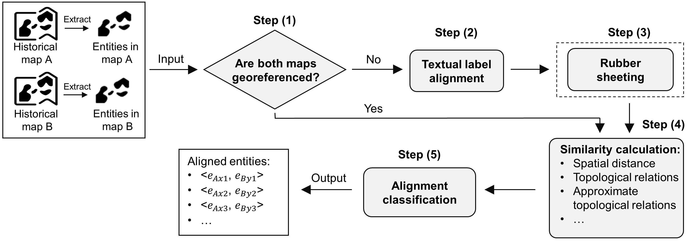

# Aligning geographic entities from historical maps for building knowledge graphs

### Overall description

Historical maps contain a lot of valuable information. However, it is time-consuming and labor-intensive to use the contained information in historical maps due to their paper-based or scanned image formats. One promising way to facilitate the use of contained information is to represent contained information as a geographic knowledge graph. A key step of constructing geographic knowledge graph for historical maps is to align historical entities. However, existing methods about geographic entities alignment or map conflation could not deal with aligning entities from historical maps due to limited information available in historical maps. Here, we propose a general workflow and its possible methodological implementations to align geographic entities from historical maps to facilitate the use of information contained in historical maps.

### Overall workflow

Our proposed workflow is designed to function automatically, which takes the digitized entities from two maps as the input and outputs the aligned pairs. An overview of this workflow consisting of five steps is provided in the following figure. In step (1), it examines whether the two historical maps have georeference information. If luckily “Yes”, the workflow overlays the entities from these two maps (after performing project transformations, if necessary), and proceeds to step (4) to calculate the similarity scores of the entities based on their spatial distances, topological relations, and others. If ‘NO’, the workflow moves to step (2) and performs textual label alignment to identify the entities that can be aligned based on their names. With the aligned entities, the workflow automatically evaluates whether rubber sheeting can be performed to further adjust the spatial positions of the entities so that they can be overlaid. If so, the workflow moves to step (3) for the operation of rubber sheeting; otherwise, it proceeds to step (4). In step (4), the workflow will automatically select the suitable metrics for similarity calculation depending on how it reaches this step. Finally, step (5) combines the similarity scores to perform alignment classification and outputs the entity pairs that can be aligned.

### Resources

This repository contains the source code and the two experimental datasets of historical maps.

1. Datasets

There are two experimental datasets shared in the folder of ‘data’, named ‘Buf’ and ‘UBSC’. The dataset ‘Buf’ includes three historical maps in the city of Buffalo, NY in the years of 1889, 1899, and 1925. The dataset ‘UBSC’ includes three historical maps covering the south campus of the University at Buffalo and in the years of 1966, 1982, and 1990. There are three sub-folders for each dataset: ‘OriginalMapImages’ which contains the original historical map images to be digitized, ‘DigitizedMaps’ which contains the digitized results of original map images, and ‘GroundTruth’ which contains all existing alignments of entities from each two map pairs in the consecutive years.

2. Source code
* execute_align.py is to read datasets in the format of Shapefile and organize all the following Python files to implement the proposed general workflow. 
* text_label_match.py implements all the methods used to align entities with textual labels.
* santos2018a.py is to use deep learning model to find alignments of entities with textual labels. 
* santos2018b.py is to use a trained Random Forest model to obtain alignments of entities with textual labels. The input of this model is 13 string similarity scores which are computed with the file of similaritymetrics.py. 
* acheson2019.py is also to use a trained Random Forest model to match textual labels of entities. This model takes 6 similarity scores of strings as input. 
* overlay_entities.py is first to examine whether digitized historical maps can be overlaid by computing control points. If ‘Yes’, this file will perform filtering of control points and rubber sheeting (specifically using affine transformation) for input maps. This file also retrieves entities which are intersected or within the overlapping area of input maps if they can be overlaid. 
* similarity_computation.py implements the computation of proposed similarity measures including: spatial distance, topological relations, and approximate topological relations.
* classsification.py implements all seven classifying methods using the computed similarity matrix.
* evaluate_performance.py is used to write found alignments into a file and compute the evaluation metrics.

### Packages

Install required package with the file ‘requirements.txt’.

### Experiments

The process of doing experiments is first to choose the best textual label match method to lay the foundation for affine transformation. With the affine transformed maps, matrix of similarity metrics will be computed. Distance-based methods will be first used to classify entity pairs, and the best distance metric can be selected according to the results of distance-based methods. Other classification methods can be tested then.
1. Identify alignments of entities with textual label
Call the function ‘execute_alignment’ in Python file ‘execute_align.py’. There are 5 parameters in this function. The first two parameters are a Python List of the paths of all digitized files of two historical maps (Users can find the paths in the folder ‘data’). The third parameter is the path of corresponding ground truth which can also be found in the folder ‘data’. The fourth parameter is name of textual label match method, and users can choose them from the file text_label_match.py. The fifth parameter is to present whether users only obtain the result of textual label match. This step is just to find the best textual label matching method; thus, the fifth parameter should be ‘True’.
2. Similarity computation
Still call the function ‘execute_alignment’. Users just need to input first four parameters. Specifically, the fourth parameter should be the best textual label method selected in the first step (For the provided datasets, the best textual label method is ‘simple_str_case_punc’).  Then, this program will automatically compute control points and decide whether affine transformation can be performed. Suitable similarity metrics will be selected, and similarity matrix will be computed automatically according to whether entities are overlaid. The similarity matrix will be stored in a Python Pickle file.
3. Obtain the results of distance-based methods
Call the function ‘alignment_classification’. The first parameter is the path of Python Pickle file generated in last step. The second parameter should be ‘dist’ in this step. The third parameter is the path of result file of textual label match. The fourth parameter is the path of ground truth. Then users run the code and can obtain the results of distance-based methods.
4. Obtain results of all classification methods
Still call the function ‘alignment_classification’. Users need to modify the second parameter to tell the program which classification method will be used to make a decision. For methods which combine the distance-based method and other method, such as ‘dist_topo’, ‘dist_approx’, and ‘dist_topo_approx’, the fifth parameter should be decided to show which distance metric will be used (There are four types of distance metrics. For the provided datasets, the best distance metric should be ‘dist_hdv’). Then users can obtain results of all proposed methods.
